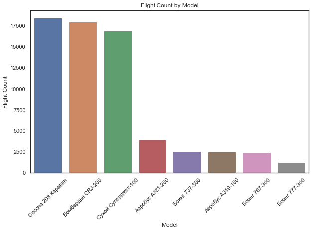
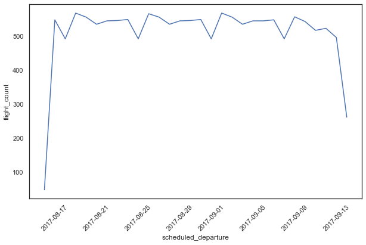
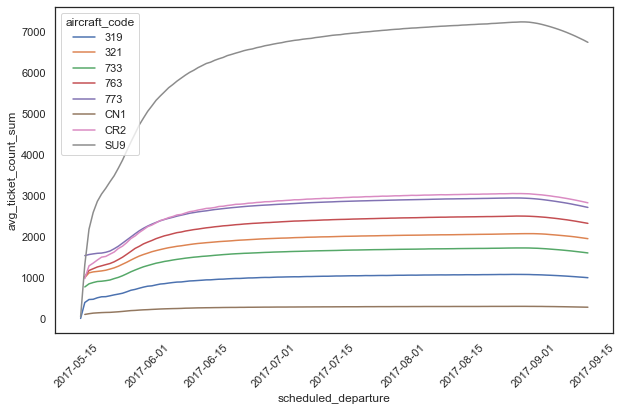

### Импорт библиотек для работы с бд и дф


```python
import psycopg2
import pandas as pd
import sqlalchemy
import seaborn as sns
import matplotlib.pylab as plt
```

### Кредиты для коннекта к бд


```python
conn = psycopg2.connect(host="45.134.254.239", port="25432", database="demo", 
                            user="Student_01", password="123456789")
```


```python
cur = conn.cursor()
```

### количество рейсов в разрезе модели самолета;


```python
cur = conn.cursor()

cur.execute('''
           SELECT 
            aircraft_code,
            model -> 'ru',
            count(DISTINCT flight_id) as flight_count
            FROM flights l
            left join aircrafts_data r 
            using(aircraft_code)
            GROUP BY aircraft_code, model
            order by flight_count desc
            ''')

results = cur.fetchall()
df = pd.DataFrame(results, columns=['aircraft_code', 'model', 'flight_count'])
df.head()
```


<div>
<style scoped>
    .dataframe tbody tr th:only-of-type {
        vertical-align: middle;
    }

    .dataframe tbody tr th {
        vertical-align: top;
    }

    .dataframe thead th {
        text-align: right;
    }
</style>
<table border="1" class="dataframe">
  <thead>
    <tr style="text-align: right;">
      <th></th>
      <th>aircraft_code</th>
      <th>model</th>
      <th>flight_count</th>
    </tr>
  </thead>
  <tbody>
    <tr>
      <th>0</th>
      <td>CN1</td>
      <td>Сессна 208 Караван</td>
      <td>18394</td>
    </tr>
    <tr>
      <th>1</th>
      <td>CR2</td>
      <td>Бомбардье CRJ-200</td>
      <td>17920</td>
    </tr>
    <tr>
      <th>2</th>
      <td>SU9</td>
      <td>Сухой Суперджет-100</td>
      <td>16870</td>
    </tr>
    <tr>
      <th>3</th>
      <td>321</td>
      <td>Аэробус A321-200</td>
      <td>3872</td>
    </tr>
    <tr>
      <th>4</th>
      <td>733</td>
      <td>Боинг 737-300</td>
      <td>2522</td>
    </tr>
  </tbody>
</table>
</div>


```python
plt.figure(figsize=(10, 6))
sns.barplot(data=df, x="model", y="flight_count")
plt.title('Flight Count by Model')
plt.xlabel('Model')
plt.ylabel('Flight Count')
plt.xticks(rotation=45)
plt.show()
```


    

    


### количество запланированных рейсов по датам


```python
cur.execute('''
select 
date_trunc('day',scheduled_departure)::date,
count(flight_id) as flight_count
from flights f 
where status = 'Scheduled'
group by date_trunc('day',scheduled_departure)
order by date_trunc('day',scheduled_departure)
            ''')

results = cur.fetchall()
df = pd.DataFrame(results, columns=['scheduled_departure', 'flight_count'])
df.head()
```


<div>
<style scoped>
    .dataframe tbody tr th:only-of-type {
        vertical-align: middle;
    }

    .dataframe tbody tr th {
        vertical-align: top;
    }

    .dataframe thead th {
        text-align: right;
    }
</style>
<table border="1" class="dataframe">
  <thead>
    <tr style="text-align: right;">
      <th></th>
      <th>scheduled_departure</th>
      <th>flight_count</th>
    </tr>
  </thead>
  <tbody>
    <tr>
      <th>0</th>
      <td>2017-08-16</td>
      <td>48</td>
    </tr>
    <tr>
      <th>1</th>
      <td>2017-08-17</td>
      <td>549</td>
    </tr>
    <tr>
      <th>2</th>
      <td>2017-08-18</td>
      <td>493</td>
    </tr>
    <tr>
      <th>3</th>
      <td>2017-08-19</td>
      <td>569</td>
    </tr>
    <tr>
      <th>4</th>
      <td>2017-08-20</td>
      <td>557</td>
    </tr>
  </tbody>
</table>
</div>


```python
plt.figure(figsize=(10, 6))
sns.lineplot(data=df, x="scheduled_departure", y="flight_count")
plt.xticks(rotation=45)
plt.show()
```


    

    


### топ аэропортов по количеству прилетающих рейсов


```python
cur.execute('''
select 
departure_airport,
airport_name -> 'ru',
city -> 'ru',
count(*) as flight_count
from flights l
left join airports_data r 
on l.departure_airport = r.airport_code 
where status = 'Arrived'
group by 
departure_airport,
airport_name,
city
order by flight_count desc 
            ''')

results = cur.fetchall()
df = pd.DataFrame(results, columns=['departure_airport', 'airport_name', 'city', 'flight_count'])
df.head()
```


<div>
<style scoped>
    .dataframe tbody tr th:only-of-type {
        vertical-align: middle;
    }

    .dataframe tbody tr th {
        vertical-align: top;
    }

    .dataframe thead th {
        text-align: right;
    }
</style>
<table border="1" class="dataframe">
  <thead>
    <tr style="text-align: right;">
      <th></th>
      <th>departure_airport</th>
      <th>airport_name</th>
      <th>city</th>
      <th>flight_count</th>
    </tr>
  </thead>
  <tbody>
    <tr>
      <th>0</th>
      <td>DME</td>
      <td>Домодедово</td>
      <td>Москва</td>
      <td>4776</td>
    </tr>
    <tr>
      <th>1</th>
      <td>SVO</td>
      <td>Шереметьево</td>
      <td>Москва</td>
      <td>4432</td>
    </tr>
    <tr>
      <th>2</th>
      <td>LED</td>
      <td>Пулково</td>
      <td>Санкт-Петербург</td>
      <td>2825</td>
    </tr>
    <tr>
      <th>3</th>
      <td>VKO</td>
      <td>Внуково</td>
      <td>Москва</td>
      <td>2555</td>
    </tr>
    <tr>
      <th>4</th>
      <td>OVB</td>
      <td>Толмачёво</td>
      <td>Новосибирск</td>
      <td>1571</td>
    </tr>
  </tbody>
</table>
</div>


```python
plt.figure(figsize=(10, 6))
sns.barplot(data=df.head(10), x="airport_name", y="flight_count")
plt.title('Топ 10')
plt.xticks(rotation=45)
plt.show()
```


    

    


### среднюю загруженность самолётов по типам воздушных судов  с накоплением


```python
cur.execute('''
select 
aircraft_code,
ticket_count,
sum(ticket_count) over (partition by aircraft_code order by scheduled_departure) as ticket_count_sum,
round(avg(ticket_count) over (partition by aircraft_code)) as avg,
scheduled_departure::date
from
(
select 
aircraft_code,
sum(ticket_count) as ticket_count,
date_trunc('day', scheduled_departure) as scheduled_departure
from flights l
left join 
(select 
l.flight_id,
count(*) as ticket_count
from ticket_flights l
group by flight_id) as r
using(flight_id)
group by date_trunc('day', scheduled_departure), aircraft_code
order by aircraft_code, scheduled_departure
) as a
            ''')

results = cur.fetchall()
df =pd.DataFrame(results, columns=['aircraft_code', 'ticket_count', 'ticket_count_sum', 'avg', 'scheduled_departure'])
df.head()
```


<div>
<style scoped>
    .dataframe tbody tr th:only-of-type {
        vertical-align: middle;
    }

    .dataframe tbody tr th {
        vertical-align: top;
    }

    .dataframe thead th {
        text-align: right;
    }
</style>
<table border="1" class="dataframe">
  <thead>
    <tr style="text-align: right;">
      <th></th>
      <th>aircraft_code</th>
      <th>ticket_count</th>
      <th>ticket_count_sum</th>
      <th>avg</th>
      <th>scheduled_departure</th>
    </tr>
  </thead>
  <tbody>
    <tr>
      <th>0</th>
      <td>319</td>
      <td>None</td>
      <td>None</td>
      <td>996</td>
      <td>2017-05-16</td>
    </tr>
    <tr>
      <th>1</th>
      <td>319</td>
      <td>389</td>
      <td>389</td>
      <td>996</td>
      <td>2017-05-17</td>
    </tr>
    <tr>
      <th>2</th>
      <td>319</td>
      <td>535</td>
      <td>924</td>
      <td>996</td>
      <td>2017-05-18</td>
    </tr>
    <tr>
      <th>3</th>
      <td>319</td>
      <td>480</td>
      <td>1404</td>
      <td>996</td>
      <td>2017-05-19</td>
    </tr>
    <tr>
      <th>4</th>
      <td>319</td>
      <td>614</td>
      <td>2018</td>
      <td>996</td>
      <td>2017-05-20</td>
    </tr>
  </tbody>
</table>
</div>


#### Накопительно


```python
plt.figure(figsize=(10, 6))
sns.lineplot(x='scheduled_departure', y='ticket_count_sum', hue='aircraft_code', 
             data=df)
plt.xticks(rotation=45)
plt.show()
```


    

    


#### Средняя загруженность


```python
df[['aircraft_code', 'avg']].drop_duplicates()
```


<div>
<style scoped>
    .dataframe tbody tr th:only-of-type {
        vertical-align: middle;
    }

    .dataframe tbody tr th {
        vertical-align: top;
    }

    .dataframe thead th {
        text-align: right;
    }
</style>
<table border="1" class="dataframe">
  <thead>
    <tr style="text-align: right;">
      <th></th>
      <th>aircraft_code</th>
      <th>avg</th>
    </tr>
  </thead>
  <tbody>
    <tr>
      <th>0</th>
      <td>319</td>
      <td>996</td>
    </tr>
    <tr>
      <th>122</th>
      <td>321</td>
      <td>1951</td>
    </tr>
    <tr>
      <th>243</th>
      <td>733</td>
      <td>1602</td>
    </tr>
    <tr>
      <th>364</th>
      <td>763</td>
      <td>2326</td>
    </tr>
    <tr>
      <th>485</th>
      <td>773</td>
      <td>2716</td>
    </tr>
    <tr>
      <th>606</th>
      <td>CN1</td>
      <td>274</td>
    </tr>
    <tr>
      <th>727</th>
      <td>CR2</td>
      <td>2829</td>
    </tr>
    <tr>
      <th>848</th>
      <td>SU9</td>
      <td>6756</td>
    </tr>
  </tbody>
</table>
</div>


```python
plt.figure(figsize=(10, 6))
sns.barplot(data=df[['aircraft_code', 'avg']].drop_duplicates(), x="aircraft_code", y="avg")
plt.xticks(rotation=45)
plt.show()
```


    

    


### ранжирование аэропортов по средней задержке вылета


```python
cur.execute('''

select 
departure_airport,
minutes,
dense_rank() over (order by minutes) as dense_rank
from 
(
select 
departure_airport,
round(extract(epoch from avg(actual_departure - scheduled_departure)) / 60) as minutes
from flights f 
where 
scheduled_departure < actual_departure
group by departure_airport
) as a
            ''')

results = cur.fetchall()
df = pd.DataFrame(results, columns=['departure_airport', 'minutes', 'dense_rank'])
df.head()
```


<div>
<style scoped>
    .dataframe tbody tr th:only-of-type {
        vertical-align: middle;
    }

    .dataframe tbody tr th {
        vertical-align: top;
    }

    .dataframe thead th {
        text-align: right;
    }
</style>
<table border="1" class="dataframe">
  <thead>
    <tr style="text-align: right;">
      <th></th>
      <th>departure_airport</th>
      <th>minutes</th>
      <th>dense_rank</th>
    </tr>
  </thead>
  <tbody>
    <tr>
      <th>0</th>
      <td>USK</td>
      <td>3</td>
      <td>1</td>
    </tr>
    <tr>
      <th>1</th>
      <td>OSW</td>
      <td>5</td>
      <td>2</td>
    </tr>
    <tr>
      <th>2</th>
      <td>UKX</td>
      <td>6</td>
      <td>3</td>
    </tr>
    <tr>
      <th>3</th>
      <td>KYZ</td>
      <td>6</td>
      <td>3</td>
    </tr>
    <tr>
      <th>4</th>
      <td>EYK</td>
      <td>6</td>
      <td>3</td>
    </tr>
  </tbody>
</table>
</div>


```python
plt.figure(figsize=(200, 100))
sns.barplot(data=df, x="departure_airport", y="dense_rank")
plt.xticks(rotation=45)
plt.show()
```


    

    

